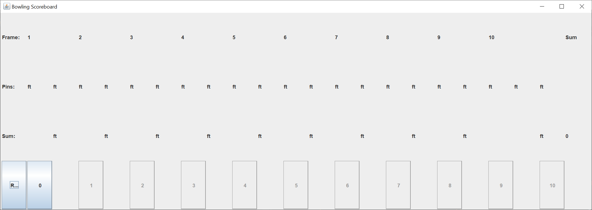
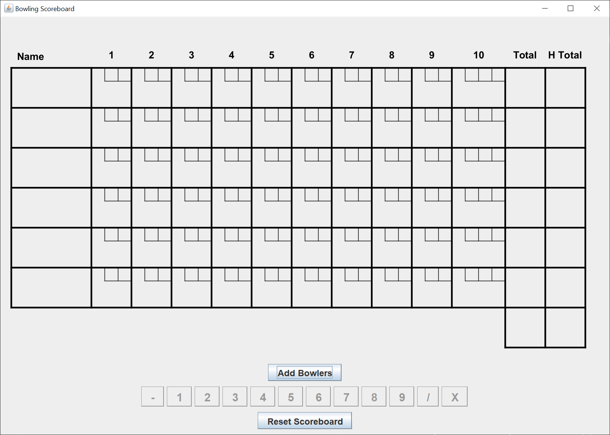
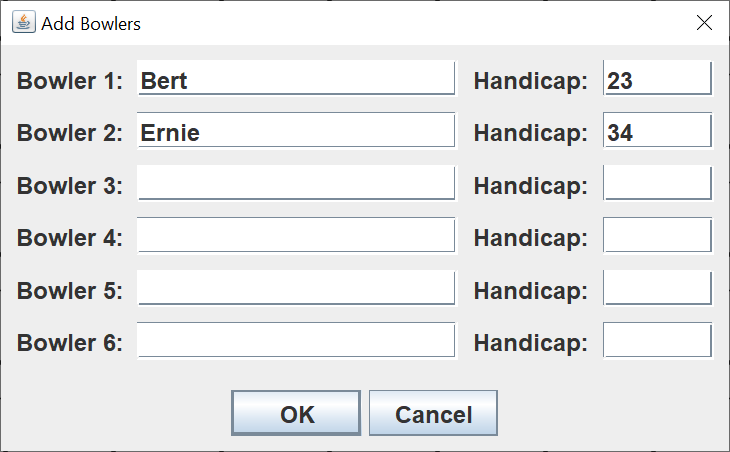
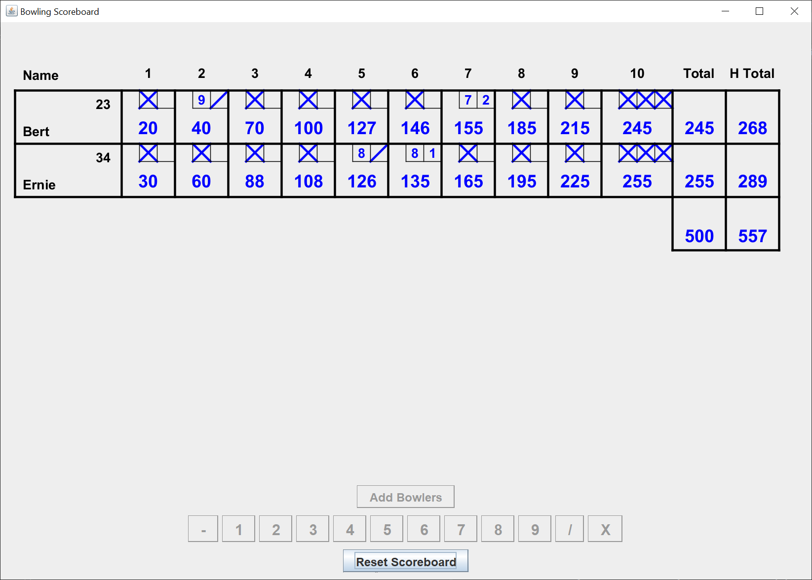

# Bowling Scoreboard

## Introduction

Recently, on Stack Overflow, a Russian student posted a question.  He was given a Java Swing bowling scoreboard GUI, and his assignment was to create the application model that would drive the GUI.  

Kudos to the professor for simulating a real-world assignment.  

Knocks against the professor for creating one of the worst Swing GUIs I had ever seen.  

The GUI is 2080 x 740 pixels.  Every test of the GUI required 21 button clicks.  That got old real fast, especially since I needed to run about a dozen tests just to find out how the GUI interacted with the application model.  The GUI text is in an ordinary font size, which was hard to read on a GUI that took up most of my 4K monitor.

I decided to create a much nicer Swing GUI and a GUI that didn't place so much responsibility on the application model.  I feel like I succeeded on both goals.

Here's the Java Swing GUI when you start the application.

The GUI is 1110 x 791 pixels.  You can score up to six bowlers at a time.

To start the Swing GUI, you left-click on the "Add Bowlers" button.  This brings up the following dialog.

I've typed two names and league handicaps.  The handicaps are optional fields.  You can type up to six names.  This adds the bowler's names and handicaps to the main GUI.  Pressing the Enter key is the same as left-clicking on the "OK" button.  This is useful to a user when filling out a form, as their hands are already on the keyboard.

After scoring a game, this is what the GUI looks like.

## Explanation

If you’re not familiar with Java Swing, Oracle has an excellent tutorial to get you started, [Creating a GUI With Swing](https://docs.oracle.com/javase/tutorial/uiswing/index.html). Skip the Netbeans section.

Whenever I create a Swing GUI, I use the [model / view / controller](https://en.wikipedia.org/wiki/Model%E2%80%93view%E2%80%93controller) (MVC) pattern.  This pattern allows me to more easily separate my concerns and focus on one part of the Swing application at a time.

I create a logical model of the game using one or more plain Java getter / setter classes.  For this particular Swing application, I created three model classes.

The view consists of a `JFrame`, a drawing `JPanel`, and a control `JPanel`.

The controller consists of as many listener classes as you need to perform the GUI functions.  Generally, these classes are independent of each other.  There's usually no need for a "master" controller class to rule them all.

The reason it's called the MVC pattern is you create the model first, then the view, then the controller.  This is usually not a waterfall process.  You create as much of the model as you can think of, then when you're working on the view, you realize that some pieces of the model are missing.  Even when you're writing controller classes, you can still discover missing pieces of the model.

For this particular application, I created the view first.  A bowling scoreboard has a very standard appearance.  After creating the view, I created a model to support the view.  the model went through several iterations before I was satisifed.  As I said, this is usually not a waterfall process.

To summarize, in a Swing application, the MVC pattern looks like this:

1.  The view reads information from the model.
2.  The view does not update the model.
3.  The controller updates the model and repaints / revalidates the view.

### Model

I created three model classes, `BowlingscoreboardModel`, `Bowler`, and `BowlingScore`.  

`BowlingScoreboardModel` is the main application model class.  `BowlingSoreboardModel` is a plain Java getter/setter class.  It holds `int` fields to indicate the current frame, bowler, and throw.  It also holds `int` fields to indicate the number of bowlers and the maximum number of bowlers.  Finally, the model class holds an array of `Bowler` instances and an array of `BowlingScore` instances.

`Bowler` is a plain Java getter/setter class that holds a bowler's name and handicap.

`BowlingScore` is a plain Java getter/setter class that calculates the score of one game for one bowler.  Even though I'd written this class to animate the professor's Swing GUI, I had difficulty coding this class.  I finally had to write a tester application just so I could code and test this class without using the GUI I developed.

Here's what I wound up doing.  I created a marks `String` for each bowler.  This made the GUI much easier to draw.  Here's an example marks `String` fram my tester application.

    X 8/72X X 81X X X XX4
    
The `String` is made up of 20 or 21 characters.  Each character represents a throw.

The first thing I did was parse the marks `String` into frames.  Here's what the result looks like, printed.

    [X , 8/, 72, X , X , 81, X , X , X , XX4]
    
Lastly, I calculated the score for each frame.  The score is a running total pin count for the bowler.

Scoring in bowling is easy to explain.  it's rather dificult to code.  The scoring rules are:

1.  A frame consists of two throws.  You may throw a third throw in the tenth frame.
2.  Knocking down all ten pins on the first throw of the frame is called a strike, indicated by an X.
3.  Knocking down all ten pins on two throws in the frame is called a spare, indicated by a slash (/).
4.  If you knock down less then 10 pins in two throws, your score for the frame is the number of pins you knocked down.
5.  If you get a spare, your score is 10 plus the number of pins you knock down on the next throw.
6.  If you get a strike, your score is 10 plus the number of pins you knock down on the next two throws.
7.  If you get a strike or a spare in the tenth frame, you get one additional throw.

So, here is a print of the calculated score for the example marks `String` I gave.

    [20, 37, 46, 74, 93, 102, 132, 162, 192, 216]
    
As you can see, if you're good enough to throw strikes, your score can add up.  The maximum score, 12 strikes in a row, is 300.
